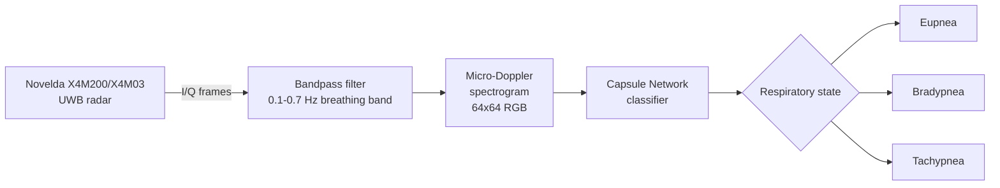
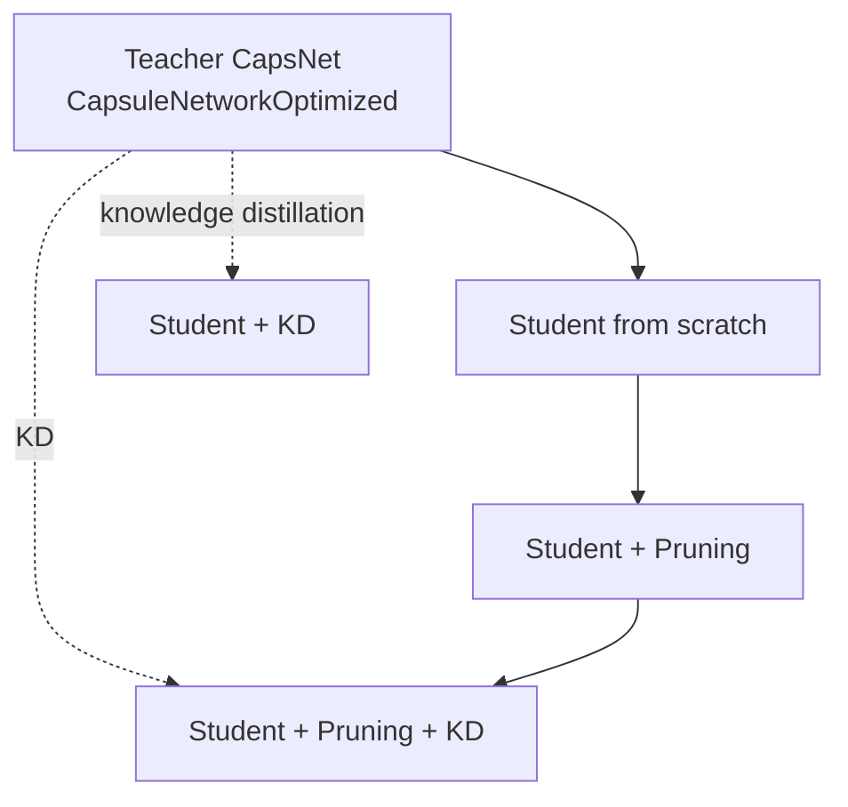

# EdgeCaps: Pruned Capsule Networks for RF Respiratory Monitoring

Lightweight, edge-deployable **Capsule Networks** for contactless respiratory-rate
classification from **ultra-wideband (UWB) radar**. EdgeCaps takes raw radar
in-phase/quadrature (I/Q) signals, turns them into micro-Doppler spectrograms, and
classifies the breathing state into one of three classes:

| Class | Meaning |
| --- | --- |
| **Eupnea** | Normal breathing |
| **Bradypnea** | Abnormally slow breathing |
| **Tachypnea** | Abnormally fast breathing |

A full-size **teacher** Capsule Network is compressed into an **ultra-small student**
through **knowledge distillation** and **L1 pruning** so that the final model runs in
real time on a **Raspberry Pi 4** paired with a Novelda X4M200/X4M03 radar — no
contact sensors, cameras, or cloud connection required.

> **License:** [CC0 1.0 Universal](LICENSE) (public domain dedication).

---

## Table of contents

- [How it works](#how-it-works)
- [Model zoo](#model-zoo)
- [Repository layout](#repository-layout)
- [Installation](#installation)
- [Dataset format](#dataset-format)
- [Running the pipeline](#running-the-pipeline)
- [What gets measured](#what-gets-measured)
- [Hyperparameter sweeps](#hyperparameter-sweeps)
- [Analysis](#analysis)
- [Edge deployment (Raspberry Pi)](#edge-deployment-raspberry-pi)
- [Results](#results)
- [Citation](#citation)

---

## How it works



The radar reflects pulses off the chest wall; chest displacement during breathing
modulates the returned signal. EdgeCaps isolates the breathing band, renders a
spectrogram image, and lets a Capsule Network — which preserves spatial/pose
relationships through **dynamic routing** — recognize the breathing pattern.

The compression pipeline produces five model variants from the same architecture so
they can be compared head-to-head:



---

## Model zoo

All models classify a `3 x 64 x 64` spectrogram into 3 classes.

### Capsule networks (this work)

| Model | File | Conv stack | Input capsules | Capsule dim | Routings |
| --- | --- | --- | --- | --- | --- |
| **Teacher** (`CapsuleNetworkOptimized`) | `src/models/teacher_capsule_model.py` | 16 → 32 → 16 | 16 | 8D | 3 |
| **Student** (`CapsuleNetworkUltraSmall`) | `src/models/student_capsule_model.py` | 2 → 4 → 8 | 4 | 4D | 1 (default) |

The shared dynamic-routing capsule layer lives in `src/models/capsule_layer.py`
(`CapsuleLayer`), a PyTorch port of the classic squash + routing-by-agreement
formulation.

### Baselines

Standard efficient backbones for comparison (`src/models/baseline_models.py`,
torchvision):

- MobileNetV3-Small
- ShuffleNetV2 (x0.5)
- SqueezeNet 1.0
- ResNet-50

---

## Repository layout

```
.
├── src/                                 # Core library
│   ├── models/
│   │   ├── capsule_layer.py             # Dynamic-routing capsule layer
│   │   ├── teacher_capsule_model.py     # Teacher (CapsuleNetworkOptimized)
│   │   ├── student_capsule_model.py     # Student (CapsuleNetworkUltraSmall)
│   │   └── baseline_models.py           # MobileNetV3 / ShuffleNet / SqueezeNet / ResNet-50
│   ├── training/
│   │   ├── train_models.py              # Supervised training loop + early stopping
│   │   ├── distillation.py              # KD loss + distillation training loop
│   │   └── utils.py                     # EarlyStopping, LR schedulers
│   ├── pruning/
│   │   ├── structured.py                # L1 filter (structured) pruning
│   │   ├── unstructured.py              # L1 weight (unstructured) pruning
│   │   └── pruning_pipeline.py          # Prune → finalize → compress → rebuild
│   ├── evaluation/
│   │   ├── metrics.py                   # Accuracy / precision / recall / F1
│   │   └── evaluate.py                  # evaluate_and_log (size/FLOPs/sparsity vs teacher)
│   ├── data/loader.py                   # ImageFolder loader, train/val/test split
│   └── utils.py                         # Param count, model size, FLOPs, sparsity
│
├── scripts/
│   ├── run_experiment.py                # End-to-end pipeline (entry point)
│   └── params_sweep.sh                  # SLURM array job (grid sweep)
│
├── experiments/
│   ├── final_training.py                # Train teacher + distilled student from best params
│   ├── run_teacher_student_distillation_exp.py  # W&B sweep training script
│   ├── inference.py                     # Inference-time benchmarking
│   ├── sample_dataset.py                # Dataset helpers
│   ├── call_wandb.py                    # Weights & Biases helpers
│   └── best_parameters.yaml             # Best teacher/distillation hyperparameters
│
├── config/
│   ├── final/full_pipeline.yaml         # Final teacher/student/distill settings
│   └── tuning/teacher_student.yaml      # W&B sweep search space
│
├── notebooks/
│   └── sota_comparison.ipynb            # Aggregate results + publication plots
│
├── edge_deployment/                     # Raspberry Pi deployment (see its own README)
│   ├── radar_writer/                    # Radar acquisition (Python 3.5 / ARMHF chroot)
│   ├── inference/                       # Real-time PyTorch inference (Python 3.8+)
│   ├── README.md
│   └── raspberry_pi_setup.md            # Full dual-environment setup guide
│
├── run_job.sh                           # SLURM launcher
└── LICENSE
```

---

## Installation

### Training / experimentation environment

```bash
git clone <your-repo-url>
cd EdgeCaps-Pruned-Capsule-Networks-for-RF-Respiratory-Monitoring

python -m venv torch-env
source torch-env/bin/activate
pip install --upgrade pip

# Core dependencies
pip install torch torchvision numpy scikit-learn pandas pyyaml matplotlib
# Model-complexity tooling used by the evaluation step
pip install thop ptflops
# Optional, for sweeps and logging
pip install wandb
```

`scripts/run_experiment.py` is run as a module, so make sure the project root is on
your `PYTHONPATH`:

```bash
export PYTHONPATH=$PWD
```

> The Raspberry Pi deployment uses a separate, dual-Python environment. See
> [Edge deployment](#edge-deployment-raspberry-pi).

---

## Dataset format

Spectrogram images are expected in a standard `torchvision.datasets.ImageFolder`
layout, one subfolder per class. Images are resized to `64 x 64` and read as 3-channel
RGB (the radar spectrograms are rendered with the `jet` colormap):

```
data/EdgeCaps_datasets/
├── eupnea/
│   ├── 0001.png
│   └── ...
├── bradypnea/
│   └── ...
└── tachypnea/
    └── ...
```

The loader (`src/data/loader.py`) splits the dataset into train / validation / test
(default 80 / 10 / 10) with a fixed seed for reproducibility.

> The dataset itself is **not** included in this repository. Point `--data_path` at your
> own spectrogram dataset.

---

## Running the pipeline

The single entry point trains and evaluates every model variant in sequence — teacher,
student-from-scratch, pruned student, KD student, pruned + KD student, and all four
baselines — then writes a results CSV.

```bash
export PYTHONPATH=$PWD

python -m scripts.run_experiment \
    --data_path   data/EdgeCaps_datasets \
    --prune_ratio 0.3 \
    --temperature 5 \
    --alpha       0.7 \
    --lr          1e-4 \
    --batch_size  16
```

| Argument | Default | Description |
| --- | --- | --- |
| `--data_path` | `./data/EdgeCaps_datasets` | Root of the ImageFolder dataset |
| `--prune_ratio` | `0.3` | Fraction pruned (structured + unstructured L1) |
| `--temperature` | `5.0` | Distillation softmax temperature |
| `--alpha` | `0.7` | KD-loss weight (vs. cross-entropy) |
| `--lr` | `1e-4` | Adam learning rate |
| `--batch_size` | `16` | Batch size |
| `--job_id` | PID | Tag for checkpoint/result filenames |

Results are written to `csv_4/model_results_job_<id>_alpha_<a>_temp_<t>_ratio_<p>_lr_<lr>.csv`,
and best checkpoints to `models_2/`.

### Compression recipe in brief

- **Knowledge distillation** (`src/training/distillation.py`): the student is trained
  with a blended loss — `alpha * KL(student ‖ teacher) * T² + (1 - alpha) * CE(student, labels)`.
- **Pruning** (`src/pruning/pruning_pipeline.py`): applies L1 **structured** (whole
  filters) and **unstructured** (individual weights) pruning, then *physically* removes
  zeroed filters, rewires the following layer's input channels, and rebuilds the
  classifier head before fine-tuning.

### Train the final model directly

To train just the teacher and the distilled student from the tuned settings:

```bash
cd experiments
python -m experiments.final_training      # reads experiments/best_parameters.yaml
```

---

## What gets measured

For every model, `evaluate_and_log` (`src/evaluation/evaluate.py`) records both quality
and efficiency, plus the reduction relative to the teacher:

- **Quality:** accuracy, precision, recall, F1 (macro-averaged)
- **Efficiency:** parameter count, on-disk size (MB), FLOPs (GFLOPs), weight sparsity
- **Relative to teacher:** `param_reduction_%`, `size_reduction_%`, `flops_reduction_%`

Inference-time latency on the target device is benchmarked separately with
`experiments/inference.py` (`compare_model_inference`), and the on-device pipeline logs
latency, CPU/RAM, temperature, and power per prediction (see edge deployment).

---

## Hyperparameter sweeps

### SLURM grid sweep

`scripts/params_sweep.sh` / `run_job.sh` launch a 108-run array job over the grid:

| Parameter | Values |
| --- | --- |
| `prune_ratio` | 0.2, 0.3, 0.4 |
| `temperature` | 3, 5, 7 |
| `alpha` | 0.1, 0.3, 0.5, 0.7 |
| `lr` | 1e-3, 1e-4, 1e-5 |

```bash
sbatch scripts/params_sweep.sh
```

> Adjust the `#SBATCH` directives (partition, GPU, paths) to match your cluster.

### Weights & Biases sweep

`config/tuning/teacher_student.yaml` defines a Bayesian search over learning rate,
alpha, temperature, epochs, batch size, LR-schedule type, and warmup, optimizing
`distill_val_accuracy`. Drive it with `experiments/run_teacher_student_distillation_exp.py`:

```bash
wandb sweep config/tuning/teacher_student.yaml
wandb agent <sweep-id>
```

---

## Analysis

`notebooks/sota_comparison.ipynb` aggregates the per-run CSVs, selects the best
configuration per model, and produces the comparison plots (accuracy vs. model size,
and accuracy / precision / recall / F1 bar charts) used for the state-of-the-art
comparison.

---

## Edge deployment (Raspberry Pi)

The model runs on a **Raspberry Pi 4** with a **Novelda X4M200/X4M03** UWB radar. Because
the radar's `ModuleConnector` library only ships binaries for Python 3.5 while PyTorch
needs Python 3.8+, deployment uses a **dual-environment** design that communicates over a
shared directory:

```
Novelda X4M200 Radar
        │
        ▼
Python 3.5 ARMHF chroot (32-bit) ── ModuleConnector ── radar acquisition
        │
        ▼
   /shared_data  (current.npy + batch_info.json)
        │
        ▼
Python 3.8+ host (64-bit) ── PyTorch ── real-time inference
        │
        ▼
 Respiratory classification + on-device telemetry
```

- `edge_deployment/radar_writer/complete_radar_writer.py` configures the X4 radar and
  continuously writes ~15-second I/Q batches to `/shared_data`.
- `edge_deployment/inference/final_inference.py` polls `/shared_data`, builds the
  spectrogram, runs the distilled model, prints/logs the prediction, and records
  **latency, CPU, RAM, temperature, and power** (via an optional INA219 sensor) to
  `inference_log.csv`.

Full step-by-step setup — ARMHF chroot, Boost, ModuleConnector, shared-mount config —
is in **[`edge_deployment/raspberry_pi_setup.md`](edge_deployment/raspberry_pi_setup.md)**.

---

## Results

The experiment pipeline emits a per-model results table. Populate the summary below
from your generated `csv_4/` output (and `metrics.csv` from the analysis notebook):

| Model | Accuracy | F1 | Params | Size (MB) | GFLOPs | Δ Size vs Teacher |
| --- | --- | --- | --- | --- | --- | --- |
| Teacher (CapsNet) | — | — | — | — | — | — |
| Student (scratch) | — | — | — | — | — | — |
| Student (Pruned) | — | — | — | — | — | — |
| Student (KD) | — | — | — | — | — | — |
| **Student (Pruned + KD)** | — | — | — | — | — | — |
| ResNet-50 | — | — | — | — | — | — |
| ShuffleNet | — | — | — | — | — | — |
| SqueezeNet | — | — | — | — | — | — |
| MobileNetV3-S | — | — | — | — | — | — |

---

## Citation

If you use EdgeCaps in your research, please cite this repository (replace the
placeholders with your publication details):

```bibtex
@misc{edgecaps,
  title        = {EdgeCaps: Pruned Capsule Networks for RF Respiratory Monitoring},
  author       = {<Authors>},
  year         = {2026},
  howpublished = {\url{<your-repo-url>}},
  note         = {Capsule networks with knowledge distillation and pruning for
                  UWB-radar respiratory classification on edge devices}
}
```

---

## License

Released under the **Creative Commons CC0 1.0 Universal** public domain dedication.
See [`LICENSE`](LICENSE) for the full text.